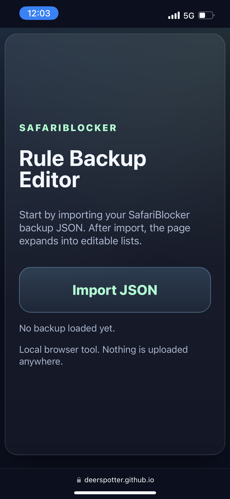
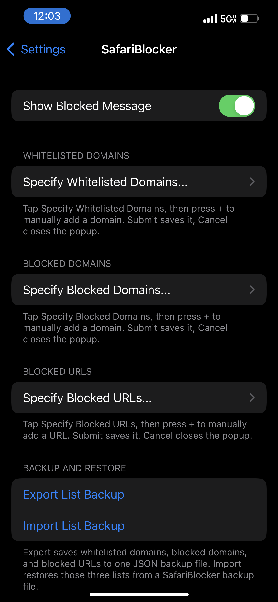

# SafariBlocker

Rootless iOS package source for `com.deerspotter.safariblocker`.

SafariBlocker provides a Settings panel for managing Safari allow and block lists. It supports manual plus button entry, visible editable lists, list backup and restore, and a static GitHub Pages rule editor for editing backup JSON files.

## Screenshots

<p align="center">
  
  
</p>

## Current package

- Package: `com.deerspotter.safariblocker`
- Name: `SafariBlocker`
- Version: `1.3.4`
- Architecture: `iphoneos-arm64`
- Minimum firmware: iOS 15.0
- Maintainer: `DeerSpotter`
- Author: `DeerSpotter`

## Capabilities

- Show or hide a blocked message.
- Manage whitelisted domains.
- Manage blocked domains.
- Manage blocked URLs.
- Add entries from Settings with a **+** popup.
- Swipe left on list entries in Settings to delete.
- Export all lists to one JSON backup file.
- Import a JSON backup file back into Settings.
- Use the GitHub Pages editor to import, edit, batch paste, copy, delete, and export rules from a browser.

## GitHub Pages rule editor

The browser based editor is hosted here after Pages is enabled:

[https://deerspotter.github.io/safariblocker/](https://deerspotter.github.io/safariblocker/)

The editor starts with one **Import JSON** button. After a SafariBlocker backup is imported, it expands into visible rows for whitelisted domains, blocked domains, and blocked URLs.

The editor can:

- Import SafariBlocker backup JSON.
- Show imported entries as visible rows.
- Add one entry with a **+** popup.
- Batch paste newline or semicolon separated lists.
- Copy any single list as plain text.
- Swipe left on mobile rows to reveal **Delete**.
- Export the edited backup JSON.

## Settings support link

The **Open DeerSpotter GitHub** row in Settings points to this repository:

[https://github.com/DeerSpotter/safariblocker](https://github.com/DeerSpotter/safariblocker)

## Building with GitHub Actions

Use the included workflow:

```text
.github/workflows/build-deb.yml
```

The expected package name follows the version in `package/DEBIAN/control`, for example:

```text
com.deerspotter.safariblocker_v1.3.4_iphoneos-arm64.deb
```

## Repository layout

```text
.github/workflows/build-deb.yml
.github/workflows/deploy-pages.yml
docs/
assets/hex/
package/
prefs/
scripts/rebuild-binaries.sh
```

## Credits

- Maintainer: `DeerSpotter`
- Current package and repository updates: `DeerSpotter`
- Original SafariBlocker tweak credit: `P2K`
